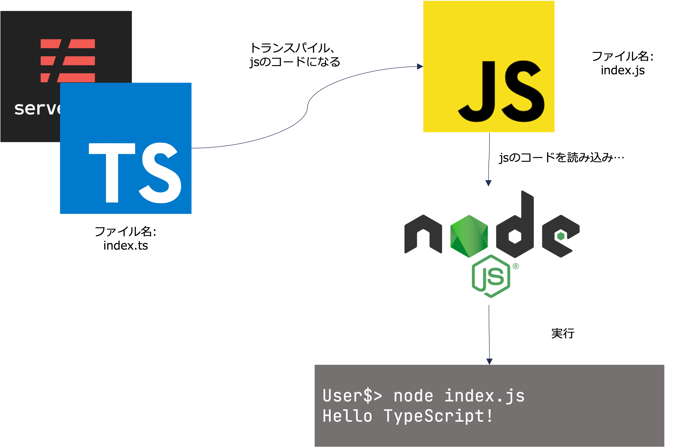

# welcome-serverless.ts
TypeScript、serverlessを使ったAPI開発のハンズオン課題です。

> ワイ「なんやTypeScriptて」  
> ワイ「JavaScriptの打ち間違いか？」  
> ワイ「きっとそうやな」  
> ワイ「誰かがタイプミスで仕様書にTypeScriptって打ち込んでもうたんや」  
> ワイ「いわばタイポスクリプトや」

引用: [ワイ「いうても型なんて面倒くさいだけやろ？」](https://qiita.com/Yametaro/items/2eaa6fd75255c8c2a2bb)


## 目次
1. はじめに: 用語の整理
2. 前提条件、狙い、お題
3. アプリケーション機能要件


## 1. はじめに: 用語の整理
このハンズオンでは、TypeScript/serverlessを利用したAPIの開発を行います。状況によってはどちらかが不要になるかもしれませんが、TypeScriptになれる目的においては不便がないと思われます。

「Progateやったことある」くらいのビギナーでもフォローを受けつつやりきれるようデザインされています。

TypeScriptをとりまく開発環境は用語が多いです。用語と関連性を先に確認しておきます。

|用語|説明|
| ---- | ---- |
|TypeScript（タイプスクリプト）|Microsoftが開発をリードしている、プログラミング言語。トランスパイルすることでJavaScriptのコードになります|
|serverless（サーバレス）|アプリケーションフレームワーク。Ruby on Rails、Djangoのようなもので、AWS環境でのデプロイ・実行に特化しています|
|JavaScript（ジャバスクリプト）|プログラミング言語。もともとはブラウザ上で実行するべく開発されており、サーバサイド用途で実行するにはnode.jsなどの実行環境が必要となります。|
|node.js（ノード・ジェーエス）|JavaScript実行環境。API、BFF、その他サーバサイド用途でJavaScriptを実行できます。|
|Java（ジャバ）|JavaScriptとはなんの関係もありません。jsはもともとLiveScriptと呼ばれていましたが、当時爆発的に流行したJavaにあやかるべくJavaScriptに改名した経緯があります。インドとインドネシアくらい違う、全く異なるプログラミング言語です。|



上記の説明のとおり、TypeScriptは最後jsのコードになるのでフロントエンドのフレームワークReactとともバックエンドのフレームワークexpressとも組み合わせられるということです


## 2. 前提条件、狙い、お題

### ハンズオンの前提条件
- 以下ソフトウェアがインストールされていること
  - Visual Studio Code
  - homebrew/nodebrew
  - node.js(v14系)
- Progateなどで、JavaScriptで簡単なプログラムを書いたことがあること
- gitを使えること

gitはなれないとしんどいですが、慣れてください。避けられません。またここでは環境構築については触れません。

### 狙い
- TypeScriptの文法になれること
- TypeScriptを用いてWeb APIの開発を経験すること

「TypeScriptを使ったAPIの開発」にフォーカスされるため、serverlessを採用していないTypeScriptプロジェクトに参画するとしても多くの側面で参考にできることがあるはずです。

### お題
地名をリクエストしたらその地名にゆかりのある出来事を返してくれるWeb APIを作りましょう。リクエストの形式、処理のシーケンス概要は次の章で説明します


## 3. アプリケーション機能要件
地名をリクエストしたらその地名にゆかりのある出来事を返すWeb APIの機能要件です。以下仕様を満たすコードを書いていきましょう。

### リクエスト・レスポンス
リクエストエンドポイント

|ドメイン|ポート|パス|
| ---- | ---- | ---- |
|localhost|3000|land|

つなげるとこんな感じです: `http://localhost:3000/land`

リクエストの形式です。

|フィールド名|日本語名|データ形式|説明|
| ---- | ---- | ---- | ---- |
|land|土地|文字列、半角英字|出来事の起きた地名。|
|pageSize|ページサイズ|半角数値|返却する検索結果の最大サイズ。|

リクエストサンプル

```json
{
    "event": {
        "land": "normandy",
        "pageSize": 3
    }
}
```

レスポンスの形式です。

|フィールド名|日本語名|データ形式|説明|
| ---- | ---- | ---- | ---- |
|land|リクエストされた土地|文字列、半角英字|リクエストで入ってきた土地名。|
|country|リクエストされた土地の国名。|文字列, 半角英字2桁||
|events|出来事|配列(オブジェクト)|その土地で起きた歴史的な出来事、複数あるはずなので配列形式としておく。|
|events:title|出来事のタイトル|文字列||
|events:happenOn|出来事が起きた年号|半角数値、4桁||

レスポンスサンプル

```json
{
    "result": {
        "land": "normandy",
        "country": "FR",
        "events": [
            {
                "title": "ノルマンディ上陸作戦",
                "happenedOn": 1944
            }
        ]
    }
}
```

### 処理のシーケンス
アプリケーションは以下の手順でコードをかいてみてください。

0. APIリクエストの解析
- APIのリクエストは文字列で入ってくるので、 `parseJson` を利用してjsのオブジェクトに変換します
- land-query-handler.tsにはすでに用意されているので、変換する型の指定だけ追加しましょう

1. 処理の前提チェック
- 0. の結果、うまく変換ができないと結果が `null` になります。 `null` だと後続の処理を継続できないのでここで処理を止めてしまいましょう。
- リクエスト形式が正しくないことを示すべく、HTTPステータスコード400でかえします。

2. 地名による検索
- リクエストの地名を使って、出来事マスタに検索を行います。
- 検索マスタは、よくあるプロジェクトではデータベースを用いますがここでは簡略化のためインメモリのオブジェクトを利用します。
- 検索用インメモリオブジェクトの在り処は続く * で説明します
- 検索結果が0件であれば1と同様HTTPステータスコード400でかえします。

3. レスポンスオブジェクトの作成
- うまく検索ができたらAPIのレスポンスとなるオブジェクトを生成しましょう。
- レスポンスの形式・サンプルを参考に検索結果をマッピングしていきます。

4. レスポンス返却、終了
- 3で作成したオブジェクトを return して終了です

### 検索用インメモリオブジェクトについて
業務としてのアプリケーション開発において、なにがしかのデータベースを用いないケースはほとんどありません。しかし、本ハンズオンはあくまで「Web APIの開発を経験すること」に主眼が置かれているのでここではデータベースの設計・セットアップはスキップすることとします。

データベースを用いない代わりに、ファイル形式で検索用簡易インメモリデータが用意されています。 src/infrastructure/historic-events.ts に配列形式のオブジェクトが用意されていますので、それを使うこととしましょう。ファイルに定義されている `HistoricEventsProperty` をインポートしてください。

ハンドラにimportする場合は以下の一行を加えます。

```ts
import { HistoricEventsProperty } from 'src/infrastructure/historic-events'
```

### アプリケーションの実行、打鍵
なんとなくできてきたらアプリケーションを起動、実行してみましょう。ハンズオンのプロジェクトはserverlessに依存しているので以下のコマンドでサーバを起動します。

```bash
serverless offline
```

起動できると、こんな感じの起動ログが表示されると思います。これでサーバの起動が完了です。

```bash
Serverless: Bundling with Webpack...
asset src/handler/sample-sns-handler.js 14.5 KiB [emitted] (name: src/handler/sample-sns-handler)
asset src/handler/land-query-handler.js 4.05 KiB [emitted] (name: src/handler/land-query-handler)
runtime modules 1.57 KiB 7 modules
built modules 1.68 KiB [built]
  modules by path ./src/handler/*.ts 1.11 KiB
    ./src/handler/land-query-handler.ts 45 bytes [built] [code generated]
    ./src/handler/sample-sns-handler.ts 1.06 KiB [built] [code generated]
  modules by path ./src/util/*.ts 548 bytes
    ./src/util/object-util.ts 122 bytes [built] [code generated]
    ./src/util/response-util.ts 426 bytes [built] [code generated]
  external "uuid" 42 bytes [built] [code generated]
webpack compiled successfully in 281 ms
Serverless: Watching for changes...
offline: Starting Offline: dev/us-east-1.
offline: Offline [http for lambda] listening on http://localhost:3002
offline: Function names exposed for local invocation by aws-sdk:
           * land-query: welcome-serverless.ts-dev-land-query
           * sample-sns-handler: welcome-serverless.ts-dev-sample-sns-handler

   ┌──────────────────────────────────────────────────────────────────────────────────────┐
   │                                                                                      │
   │   POST | http://localhost:3000/dev/land                                              │
   │   POST | http://localhost:3000/2015-03-31/functions/land-query/invocations           │
   │   POST | http://localhost:3000/dev/sns                                               │
   │   POST | http://localhost:3000/2015-03-31/functions/sample-sns-handler/invocations   │
   │                                                                                      │
   └──────────────────────────────────────────────────────────────────────────────────────┘

offline: [HTTP] server ready: http://localhost:3000 🚀
offline: 
offline: Enter "rp" to replay the last request
```


## 4. プリセットのライブラリについて
> 先生、HTTPステータスコードとかよくわかんねえよお


ここからは、実装を進めるためのヒントが提供されます。

Q. どこみればいいですか

- src/handler/land-query-handler.tsを書き進めていってほしいです。

Q. どこから手を付けたらいいのか、見当がつきません

- src/handler/sample-sns-handler.ts を参考にしてみてください。簡単ではありますが完成したサンプルがあるのでやりたいことが概ね書かれていると思います
- まずは受け取るデータの形式、返すデータの形式を `interface` で定義してから処理を始めるといいです
- サンプル実装はL47あたりにある関数 `execute` が処理の本体です。

Q. let/const/varとか違いがわからないのでTypeScriptやめてもいいですか

- やめないでもろて。まず、varは絶対に使ってはなりません。今日はこれだけ覚えて帰ってください。
- letとconstは、可能な限りconstを使うようにしましょう。constとはconstant、つまり定数のことで再代入できない変数であることを宣言します。
- 再代入については以下のサンプルコードをみてみてください。

```ts
const name = "Bill Gates"  // const キーワードで名前を宣言してみた
name = "William Henry Bill Gates"  // エラー！！！これはできない

let age = 65 // let キーワードで年齢を宣言してみた
age = 66 // letなら再代入OK！
```

Q. データの形式、なんか期待した感じにならないです

- サンプルにも実装イメージがつけられていますが、 `interface` キーワードでjsonの形式を定義してみてください。いわゆる型の定義です。

Q. APIからBadRequestとか正常なレスポンスってどうやって返すんですか

- serverlessフレームワークの仕様に合わせたレスポンスを返せるようユーティリティが用意されています。 src/util/response-util.ts に定義されている `toBadRequest` でステータスコード400, `toResponse` でステータスコード200のレスポンスを返すことができます。

Q. ループしたいんですけど...

- してください。 TypeScriptにもお約束の `for` 文はありますよ！同じように `if` 文も知っている形式でかけます

Q. null/undefinedの判断うまくいかないです

- わかる。TypeScript、というかjsのnull/undefined判定は少しややこしいです
- jsのnull/undefined判定はいくつかのやり方があります。null/undefinedを区別せず、緩めに「なんも値がないとき」くらいの条件なら `if (!value)` みたいな調子で判断しましょう。
- こちらの記事が詳しいです: [[JavaScript] null とか undefined とか 0 とか 空文字('') とか false とかの判定について - Qiita](https://qiita.com/phi/items/723aa59851b0716a87e3#%E5%90%84%E5%9E%8B-%E5%80%A4%E3%81%AE%E8%A9%95%E4%BE%A1)