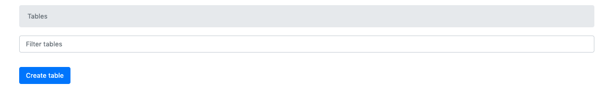
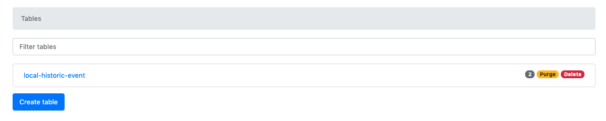
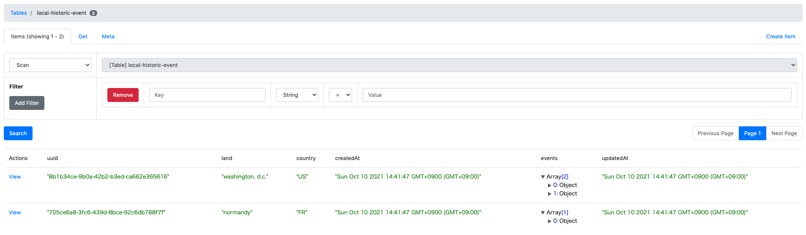

# データベースへの接続を有効可する
ハンズオンのお題ではインメモリのオブジェクトをデータベース風にみたててロジックを構築しました。
ここでは、追加のトピックとしてデータベースへの接続、およびDynamoDBに対応したマッパーの利用を行います。

## 0. 前提条件
- Dockerが利用できる環境であること

## 1. Dockerを使ってDynamoDB Localのコンテナを立ち上げる
ローカルでの開発に使えるよう、データベースのDockerコンテナを立ち上げます。

```bash
$ docker-compose up -d
```

DynamoDBにはローカル用の簡単な管理画面がついています。Dockerコンテナを起動できたら、ブラウザで http://localhost:8000 にアクセスして確認してみます。



ブラウザで確認できたら、次にテーブルとシードデータを準備します。npmスクリプトを実行し、初期化を行います。
```bash
$npm run init

> welcome-serverless.ts@1.0.0 init /Users/s.nozaki/workspace/project/btob/normandy/welcome-serverless.ts
> node aws/local/create-ddb-tables.js && node aws/local/insert-seeds.js

テーブルの作成に成功しました local-historic-event
local-historic-eventにレコードを一件登録しました
local-historic-eventにレコードを一件登録しました
```

また、ローカルの管理画面をみてみます。




データベースの初期化が完了しました。次に、マッパーを導入します。

## 2. Mapperクラスの導入
src/handler/land-query-handler.ts にサンプルコードがついているのでみてみてください。

DynamoDBへの接続情報を設定する `documentClient` を引数にマッパークラスを生成します。
```ts
const historicEventMapper = new HistoricEventMapper(documentClient)
```

`HistoricEventMapper` クラスにはfind系メソッドが生えていますが、必要に応じて追加します。

